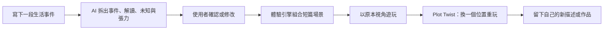

# PlotTwist：概念脈絡與候選方向

> 最後更新：2026-07-13
>
> 狀態：討論稿，尚未形成最終產品決策

這份文件將團隊早期對話整理成可討論、可刪改的共同基準。它不是規格書；文中的「建議」與「最強假說」都仍待團隊用原型與使用者回饋驗證。

## 1. 討論是怎麼走到這裡的

團隊在選題期間出現過幾條方向；它們並不全都相連，也不預設要做成同一個產品：

1. **網頁小遊戲生產線**：運用 AI 與模板，快速量產、部署短小的網頁遊戲。
2. **一般人的互動式藝術表達**：讓沒有遊戲開發能力的人，也能把自己的故事做成可分享的互動作品。
3. **「精神現實」與敘事視角**：客觀事件不一定能改變，但人如何感受、串連與解讀事件，可能改變其所處的主觀現實。能否用 AI 創造一種可重現的體驗，讓人親身察覺這件事？
4. **前端開發／觀測工具**：讓開發者能在 OpenAP 直接開發前端、取得 public URL，並看到 log 或 devtools 資訊。這是選題時提出的另一個獨立專案選項，不是敘事遊戲的子系統。

討論中曾提出把前三條的一部分接起來：用小遊戲生產技術承載個人敘事與藝術表達。其核心句子是：

> 使用者說一段生活中的事；系統把它抽象、符號化，轉成一段可以進去扮演的互動經驗，再讓使用者從另一個位置走一次。

這裡的核心不是「生成一支影片」，也不只是「把文字換成華麗畫面」，而是讓玩家的操作、限制、回饋與選擇共同傳達一個觀點。

## 2. 我們真正想驗證的命題

### 核心命題

一段 2–3 分鐘的互動體驗，是否能比一段解釋文字更直接地讓使用者感受到：

- 事件與事件的解讀並不完全相同；
- 自己不是問題本身；
- 同一組事實可以容納不只一條故事線；
- 新視角不是替使用者下結論，而是增加下一步可以怎麼走的選項。

### 「Game idea」在這裡的意思

遊戲的起點不是 genre、shader 或 UI，而是「我們想讓玩家經歷什麼」。視覺、聲音、規則與操作都應服務這個體驗目的。

因此，AI 最重要的工作不是自由生成整款遊戲，而是從故事中提出一個可被互動表達的 **experience thesis**：

> 這段體驗要讓玩家從哪一種感受，移動到哪一個新的可能位置？

能否穩定產生好的 experience thesis，是這個概念最關鍵、也最需要實驗的未知數。

## 3. 選題地圖：三個候選專案，不是一套架構

| 候選專案 | 核心使用者與輸出 | 和其他方向的關係 |
| --- | --- | --- |
| **A. 視角轉換的互動敘事** | 一般使用者輸入生活事件，得到可從另一個視角重玩的 2–3 分鐘場景 | 可以借用模板式遊戲生成，但不需要先做成通用平台 |
| **B. 網頁小遊戲生產線／互動藝術工具** | 創作者輸入主題或故事，得到可部署、可分享的網頁小遊戲 | 敘事轉換可以是其中一種模板，但不是必要核心 |
| **C. OpenAP 前端 DevTool** | 前端工程師在 OpenAP 開發畫面，取得 public URL、log、console、network 等資訊 | **獨立專案選項**；不是 A 或 B 的底層、功能或未來 roadmap |

這三個題目可以共享團隊能力與研究心得，但選擇其中一個，不代表要讓它和另外兩個互通。Hackathon 前需要選定一個主要題目，並讓 pitch、使用者與 demo 都服務同一件事。

## 4. 如果選擇 PlotTwist 敘事方向

以下是把「個人故事」「另一種敘事角度」與「網頁遊戲」結合的工作假說，不是團隊已定案的產品架構：

- 使用者：被一段日常經驗卡住、想換個角度看的人。
- 輸入：一小段生活事件。
- 輸出：可重玩兩次的 2–3 分鐘互動場景。
- 對外定位：幫助一般人進行互動式藝術表達與反思，而非提供診斷或治療。
- 最小技術引擎：AI 產生結構化的體驗規格，再由預製的機制、視覺與聲音模組組合場景。
- 誘人之處：不是叫 AI 給建議，而是讓使用者「走進」一個觀點。
- 最大風險：很容易誤入廉價正能量、替他人猜動機，或做出未經驗證的心理療效宣稱。

OpenAP DevTool 不包含在這條路線中。如果團隊選擇 OpenAP 題目，應另外為它建立獨立的問題定義、使用者流程與 Demo 計畫。

> 第 5–13 節皆以「團隊選擇候選 A」為前提，只是該方向的 POC 草案，不適用於 OpenAP DevTool。

## 5. 建議的使用者流程



關鍵設計原則：

- **AI 不決定真相。** 它應把推測標成推測，並讓使用者修改。
- **第二個視角不必比較正確。** 它只需要開出一條原本看不見、但與已知事實相容的路。
- **轉變必須發生在操作上。** 若第二輪只有換文案，就還不是有說服力的互動體驗。
- **使用者是自己故事的作者。** 系統提出素材與問題，最後的命名與保留權在使用者。

## 6. 可借用的敘事鏡頭

敘事治療可提供設計靈感，例如「人不是問題，問題才是問題」的外化觀點，以及從單一、被問題佔滿的故事中尋找被忽略的例外、能力、價值與其他故事線。這些概念不應被壓縮成固定話術，也不能因為用了相關詞彙，就把產品稱為治療。

可以先實驗的鏡頭：

- **事件／解讀分離**：哪些是看得到的事件？哪些是角色加上的意義？哪些仍未知？
- **問題外化**：把「我是失敗者」改成一個會影響空間、視野或規則的外部力量。
- **視點移動**：自己、旁觀者、未來的自己、場景中的物件，看到的線索各不相同。
- **例外時刻**：在主導故事之外，找出一次沒有完全照原規則發生的時刻。
- **價值反推**：一件事之所以刺痛，可能也透露使用者在意什麼；但答案必須由使用者確認。
- **規則改寫**：第二輪不是改寫過去，而是讓玩家選擇下一次要採用的規則或位置。

## 7. 一個具體但不綁死的 Demo 例子

使用者輸入：

> 我傳了一個很重要的訊息，對方已讀但沒有回。我開始覺得自己根本不重要。

第一輪把世界做成一條不斷拉長的走廊；玩家拖著「等待」前進，每一次查看門口，走廊都更長、霧更重。

按下 `Plot Twist` 後，玩家不是被告知「對方其實很忙」，因為系統不知道那是不是真的。第二輪改成整理場景中的卡片：

- 已知：訊息已讀、尚未收到回覆。
- 我的解讀：我不重要。
- 未知：對方目前的狀態與意圖。
- 我能選的下一步：等待、詢問、設界線、把注意力帶回自己。

當卡片從同一團霧中被分開，空間規則隨之改變。這個版本示範的是「從唯一結論，移動到仍有未知與選擇的位置」，而不是替任何人粉飾或猜測。

## 8. Hackathon POC：一個故事、一個機制、一次轉折

活動現場從 build sprint 開始到 1 分鐘影片截止約三小時；第一版應追求穩定的 vertical slice，而不是通用平台。

### 必做

1. 一個可輸入或選擇範例故事的首頁。
2. AI 產生受 schema 約束的分析：事件、解讀、未知、體驗目的與替代鏡頭。
3. 使用者可以在生成前確認／修改分析。
4. 一個預先設計好的核心遊戲機制。
5. 同一場景的兩個狀態：原始敘事與 `Plot Twist`。
6. 一個可分享的 public URL，以及斷網／模型失敗時的預製 fallback。
7. 清楚的隱私與「非治療」說明。

### 暫時不要做

- 任意 genre、任意玩法的完整遊戲生成器。
- 即時生成長影片、3D 資產或大量美術素材。
- 開放式 AI 心理諮商聊天。
- 診斷、風險判斷或療效分數。
- 帳號、社群 feed、作品市場或複雜多人功能。
- 加入與這條敘事體驗無關的 OpenAP DevTool 功能。

### 建議的技術切面

```text
Story Input
  → Narrative Structurer（LLM，只輸出受控 JSON）
  → Experience Spec（使用者可確認）
  → Template Renderer（固定機制與資產）
  → Play / Plot Twist / Reflect
```

預製組合可以沿用團隊提出的公式：

```text
畫風 × shader × 色系 × UI × VFX × 音樂風格
× game genre × game loop × 敘事角度
```

但 POC 不要真的展開所有維度。先固定大部分風格，只讓「敘事角度」與一兩個視覺參數改變，才能證明轉折來自設計，而不是 AI slop 的隨機華麗。

## 9. 兩分鐘 Demo 敘事

1. **0:00–0:20｜問題**：人會被自己對事件的單一解讀困住；文字建議常常知道了，卻沒有感覺到。
2. **0:20–0:40｜輸入**：貼入一句真實或範例故事；AI 把事件、解讀與未知拆開。
3. **0:40–1:15｜第一輪**：讓評審看見一個情緒如何變成遊戲規則。
4. **1:15–1:40｜Plot Twist**：同一組事實、另一個可操作的位置；世界規則當場變化。
5. **1:40–2:00｜遠景**：今天是一個故事、一個機制；未來是讓每個人都能把自己的經驗做成可玩的互動表達。

## 10. 如何知道概念有沒有成立

### 體驗驗證

- 使用者能否說出「事件」與「我的解讀」的差異？
- 第二輪是否真的讓人感到位置改變，而不只是換文案？
- 使用者是否感到被尊重，而不是被糾正、說教或強迫正向？
- 生成結果是否仍像「我的故事」，而不是通用 AI 文案？
- 體驗本身是否足夠有趣，即使不談心理健康也成立？

### Demo 驗證

- 能否在 30 秒內從輸入進入可玩場景？
- 模型失敗時，是否仍能用範例故事完成全流程？
- public URL、手機／筆電顯示、音訊與重玩是否穩定？
- 一分鐘影片能否在沒有口頭補充時講清楚「前後差異」？

## 11. 負責任的邊界

這個題目接近心理健康與個人脆弱經驗。WHO 近期特別提醒，未為心理健康設計或測試的生成式 AI 被拿來提供情緒支持，可能帶來嚴重風險。第一版應採取以下邊界：

- 稱為互動式藝術／反思原型，不稱為治療、診斷或 digital therapeutic。
- 不宣稱能改善疾病、創傷、焦慮、憂鬱或其他臨床結果。
- 不替第三人猜測意圖，不把傷害合理化，也不要求使用者原諒或正向思考。
- 允許跳過、返回、降低強度與刪除內容；任何公開分享都必須再次明確同意。
- 預設不長期保存原始故事；log 不應含完整私人輸入。
- 若內容涉及立即危險、自傷或他傷，停止遊戲化流程並提供尋求人類與當地緊急協助的清楚出口；POC 不假裝能處理危機。
- 若未來要進入健康產品定位，需有受訓專業者、具親身經驗的參與者、隱私／安全設計與實證評估共同參與。

## 12. 團隊可以 leverage 的能力

早期討論顯示團隊的組合適合做這個題目：

- 多媒體、影像與導演能力：把抽象概念變成兩分鐘內看得懂的體驗與影片。
- 前端工程能力：快速做出可分享、可靠的 web demo。
- 遊戲設計與實作經驗：讓機制服務情緒與主題，而不只是視覺包裝。
- 心理與醫療領域素養：幫助團隊問對問題、辨認越界風險；但不能取代臨床合作與產品驗證。

## 13. 下一次討論只需要定四件事

1. **一句體驗承諾**：我們要讓玩家在兩分鐘內，從什麼感受移動到什麼位置？
2. **一個 Demo 故事**：使用固定案例，還是冒險做現場自由輸入？
3. **一個核心機制**：什麼操作最能表達那個移動？
4. **產品定位**：台上明確說互動藝術／反思工具，還是要承擔健康產品所需的證據與安全要求？

接著才分工：體驗與腳本、AI schema／evaluation、前端遊戲、視覺聲音與 demo 影片。

## 14. 參考資料

- [OpenAI Build Week Community Hackathon - Taipei](https://luma.com/build-week-taipei)
- [sim francisco](https://github.com/tejasprabhune/simfrancisco)：團隊討論中提到的概念與 Demo 參考。值得借鏡的是遠大的 pitch、可玩的視覺層、明確的核心引擎，以及可重現的驗證方式；不是要複製它的產品題目。
- [Dulwich Centre：What is narrative therapy?](https://dulwichcentre.com.au/articles-about-narrative-therapy/what-is-narrative-therapy/)
- [Dulwich Centre：Externalising — commonly-asked questions](https://dulwichcentre.com.au/articles-about-narrative-therapy/externalising/)
- [WHO：Towards responsible AI for mental health and well-being](https://www.who.int/news/item/20-03-2026-towards-responsible-ai-for-mental-health-and-well-being--experts-chart-a-way-forward)
